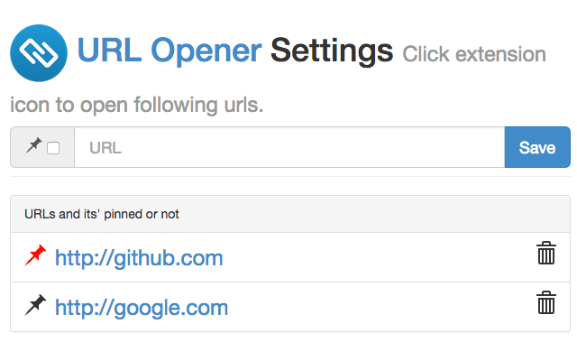

# [URL opener](http://bit.ly/url-opener)

## Usage

### 1. Add urls you want to open

Open options page from `chrome://extensions`.

### 2. Click extension icon

Registered urls will be opened with one click.

## License

GPL v3
